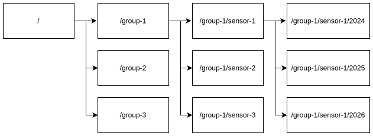

# System and Approach Overview

<!-- AV: this is still redundant, but I'm thinking about how to solve it -->
In this chapter, we discuss the developed system that (1) keeps operational oversight, aligned with the familiar day-to-day monitoring workflow by extending the existing dashboard application; (2) provides long-term documentation through a semantic data model and representation (section 3.1); and (3) enables selective data sharing through group-and-time-constrained access controll (section 3.3).

We further detail the governance layer and operationalization in sections 3.3 and 3.4, respectively.

## Data model and semantic representation

To ensure interoperability,
MuMo provides a semantic representation of all information managed in the dashboard, both environmental observations (e.g., temperature, humidity, light exposure) and sensor configuration metadata (e.g., group/location).

### Modeling sensors and observations

MuMo adopts the Flemish OSLO (Open Standaarden voor Linkende Organisaties) vocabularies and application profiles [@buyle2016oslo]. These vocabularies and application profiles—maintained by the Flemish governmental organization Digitaal Vlaanderen—reuse established international semantic standards for interoperable cross-organizational data exchange.

In particular, MuMo uses the OSLO Sensoren en Bemonstering application profile\footnote{\url{https://data.vlaanderen.be/doc/applicatieprofiel/sensoren-en-bemonstering/}}, which reuses the W3C Semantic Sensor Network ontology (SSN/SOSA) [@compton2012ssn; @ssn-sosa]. SSN/SOSA is particularly suitable because it separates (i) the sensor, (ii) the observation, and (iii) the feature of interest being observed\footnote{A primer in Dutch can be found here \url{https://museummonitoring.github.io/MUMO-Primer/}}. This allows MuMo to represent sensor redeployment and contextual change (e.g., a sensor moved to a different space) without rewriting historical observations that were produced under earlier conditions.

### Representing changing context as configuration events

Monitoring data exhibits two different dynamics:

* Observations evolve continuously and are typically appended over time.
* Configuration context evolves discretely when sensors are moved or reconfigured.

MuMo makes this distinction explicit by publishing configuration metadata as a versioned event stream, allowing consumers to reconstruct which context applied when an observation was produced. 

Group membership (or location) are encoded explicitly in this configuration stream as versioned entities. This is not merely descriptive metadata: it enables downstream systems to interpret observations correctly and consistently apply sharing rules that are expressed in terms museum staff already use (groups representing rooms, objects, loan packages, etc.). 

## Publication layer: Linked Data Event Streams

To publish this append-only log of measurements, MuMo applies the Linked Data Event Streams (LDES) technical standard\footnote{\url{https://semiceu.github.io/LinkedDataEventStreams/}}. LDES is maintained by SEMIC and actively promoted in Flanders (Digitaal Vlaanderen) for interoperable data sharing [@semic_support_centre; @vanlancker2021ldes].

LDES specifies how evolving datasets can be published incrementally in linked interoperable data fragments.
Applying LDES supports any MuMo client application to automatically ingest incremental events across organizational boundaries without relying on centralized query endpoints,
and as such allows two key consumption modes for monitoring data: replication of historical data and synchronization with newly produced data.
We introduce the LDES principles,
after which we clarify how we applied LDES in MuMo.

### LDES Principles

In LDES, data fragments are typically organized as a tree: measurements come in as events, these events are partitioned into published resources (called _fragments_), and each fragment exposes typed links to other fragments through machine-interpretable relations in RDF.
Starting from an _LDES entrypoint_,
these typed links allow automatic traversal of the fragment tree.
Listing \ref{list:relation} illustrates this with a partitioning by sensor: the entrypoint fragment links, via `tree:EqualToRelation` on `sosa:madeBySensor`, to a dedicated fragment for each sensor.
In practice, such partitionings can be composed: once a client has navigated to the fragment for the relevant sensor, that fragment can in turn act as the root of a second tree (e.g., partitioned by time windows such as month/day), enabling clients to narrow down first by source and then by interval without scanning unrelated observations.

\begin{listing}
\begin{Shaded}
\begin{Highlighting}[]
\KeywordTok{@base}\NormalTok{ }\StringTok{<https://mumo.faro.be/data/>}\NormalTok{ }\OperatorTok{.}
\KeywordTok{@prefix}\NormalTok{ }\VariableTok{tree:}\NormalTok{ }\StringTok{<https://w3id.org/tree\#>}\NormalTok{ }\OperatorTok{.}
\KeywordTok{@prefix}\NormalTok{ }\VariableTok{ldes:}\NormalTok{ }\StringTok{<https://w3id.org/ldes\#>}\NormalTok{ }\OperatorTok{.}
\KeywordTok{@prefix}\NormalTok{ }\VariableTok{sosa:}\NormalTok{ }\StringTok{<http://www.w3.org/ns/sosa/>}\OperatorTok{.}

\CommentTok{\# LDES entrypoint}
\StringTok{<stream>}
\NormalTok{  }\KeywordTok{a}\NormalTok{ }\VariableTok{ldes:}\FunctionTok{EventStream}\NormalTok{ }\OperatorTok{;}
\NormalTok{  }\VariableTok{tree:}\FunctionTok{view}\NormalTok{ }\StringTok{<by-sensor>}\NormalTok{ }\OperatorTok{.}

\CommentTok{\# <by-sensor> fragment}
\StringTok{<by-sensor>}
\NormalTok{  }\KeywordTok{a}\NormalTok{ }\VariableTok{tree:}\FunctionTok{Node}\NormalTok{ }\OperatorTok{;}
\NormalTok{  }\VariableTok{tree:}\FunctionTok{relation}\NormalTok{ }\OperatorTok{[}
\NormalTok{    }\KeywordTok{a}\NormalTok{ }\VariableTok{tree:}\FunctionTok{EqualToRelation}\NormalTok{ }\OperatorTok{;}
\NormalTok{    }\VariableTok{tree:}\FunctionTok{path}\NormalTok{ }\VariableTok{sosa:}\FunctionTok{madeBySensor}\NormalTok{ }\OperatorTok{;}
\NormalTok{    }\VariableTok{tree:}\FunctionTok{value}\NormalTok{ }\StringTok{<https://mumo.faro.be/sensors/sensor-1>}\NormalTok{ }\OperatorTok{;}
\NormalTok{    }\VariableTok{tree:}\FunctionTok{node}\NormalTok{ }\StringTok{<by-sensor/sensor-1>}\NormalTok{ }\OperatorTok{;}
\NormalTok{  }\OperatorTok{]}\NormalTok{ }\OperatorTok{;}
\NormalTok{  }\VariableTok{tree:}\FunctionTok{relation}\NormalTok{ }\OperatorTok{[}
\NormalTok{    }\KeywordTok{a}\NormalTok{ }\VariableTok{tree:}\FunctionTok{EqualToRelation}\NormalTok{ }\OperatorTok{;}
\NormalTok{    }\VariableTok{tree:}\FunctionTok{path}\NormalTok{ }\VariableTok{sosa:}\FunctionTok{madeBySensor}\OperatorTok{;}
\NormalTok{    }\VariableTok{tree:}\FunctionTok{value}\NormalTok{ }\StringTok{<https://mumo.faro.be/sensors/sensor-2>}\NormalTok{ }\OperatorTok{;}
\NormalTok{    }\VariableTok{tree:}\FunctionTok{node}\NormalTok{ }\StringTok{<by-sensor/sensor-2>}\NormalTok{ }\OperatorTok{;}
\NormalTok{  }\OperatorTok{]}\NormalTok{ }\OperatorTok{.}
\end{Highlighting}
\end{Shaded}

\centering
\caption{LDES fragmentation overview example, first fragmenting on location, then on group and lastly on time.}
\label{list:relation}
\end{listing}

### Fragmentation as a design lever

A central design choice in LDES is the fragmentation strategy: how events are grouped into fragments. MuMo uses fragmentation not only as a performance mechanism, but as a way to reflect how museums work with monitoring data and how sharing is scoped in practice. 

In MuMo, observations are fragmented along the operational dimensions that conservator and technicians naturally use: group, sensor, and time. Concretely, observations are published under a hierarchy of the form:

> `group-x / sensor-x / year / month / day`

This keeps fragments small and stable over time (e.g., daily fragments do not grow indefinitely), while retaining a navigable structure that allows clients to focus on the relevant group, sensors, and time window (example shown in Figure \ref{fig:ldes}).
Note that the group-level fragmentation is flattened: the fragment tree does not encode the group hierarchy itself. Instead, parent–child relationships between groups are provided separately in the group metadata, which is sufficient for navigation.

{#fig:ldes width=80%}

This publication model suits cross-institutional settings because it allows consumers to process only the data they are authorized to access, without requiring providers to expose tailored query endpoints. 

## Governance layer: Solid-based decentralized sharing

Cross-institution collaboration (especially loans) requires selective, revocable access across organizational boundaries.
Meanwhile, museums want to keep operational control over their monitoring infrastructures.

MuMo addresses this—conform to and supported by related work [@slabbinck2023linked]—by combining decentralized LDES publication with Solid-based authorization. Solid provides a framework in which storage (called _Solid Pods_), identity, and access control are decoupled from specific applications, enabling the same published resources to be reused by multiple clients without funneling all access through a centralized service [@solidprotocol2022; @solid_24; @solid_25].

MuMo’s governance layer consists of (1) institutional endpoints with (2) group-based authorization (3) aligned with the LDES fragmentation strategy.

{#fig:deploy-overview width=80%}

### Institutional endpoints

In MuMo, Solid Pods act as institutional data endpoints rather than user-centric storage. The practical effect is that a museum can publish monitoring resources as long-lived datasets under its governance, while granting external parties access only to the parts required for a collaboration (e.g., a loan group) and revoking that access afterward. 

### Authorization model: group-based sharing as an operational advantage

In Mumo, the authorization model is group-based: access is granted at the level of sensor groups (mirrored from the groups managed in the dashboard) rather than individual observations.
This is sufficient in museum practice:
loan scenarios typically require a partner to access the monitoring data relevant to a particular object's location over a time period, while keeping all other monitoring data private.

### Policy-aligned fragmentation (LDES + Solid together)

Solid authorization mechanisms such as Web Access Control (WAC) enforce access rules over resources and their representations [@solidprotocol2022; @wac]. 

Because LDES allows the publisher to decide how events are partitioned into resources (fragments), MuMo chooses a fragmentation strategy that makes the group the first-class boundary: the group subtree becomes the unit of sharing. 

In the deployed system, authentication is enforced at the first level of the fragment tree: users are granted access to the subtree for a given group, which implicitly includes all sensors and time slices published under that group.
The corresponding ACL files are generated from the dashboard configuration; granting a user access to a group also grants access to all of that group’s descendants.
Because the fragment tree uses a flattened group partition, a single change in the dashboard can therefore update the effective authorization for many fragments at once.

The same structure also makes it explicit that finer-grained authorization would be technically possible (e.g., sensor-level or time-range-level restrictions), but MuMo does not activate those options to remain aligned with what museum staff can practically configure in the dashboard. 
This only goes as far as the fragmentation allows, for example you cannot give access to half a day of data, as a half day is not a fragment, only full days exist.
In the current deploy an ACL file exists for the first layer in Figure \ref{fig:ldes}, but each entry point to a subtree could have an associated ACL file.

# Implementation

Figure \ref{fig:deploy-overview} shows how MuMo bridges the dashboard with synchronized Solid-based identity and authorization at runtime.

## Runtime components

MuMo consists of four main components.

**Component 1 — Solid Identity Provider (IdP).**\
The IdP is where users log in (with Solid-OIDC). After login it identifies them by their WebID, which MuMo uses as the handle for access control. A deployment can run its own IdP to issue WebIDs locally, but it can also accept WebIDs from other providers, so identity does not have to be centralized.

**Component 2 — dashboard (admin & group management).**\
The dashboard is the control plane where administrators manage groups and group hierarchies (including recursive nesting), user-to-group assignments, and cross-institution sharing by granting group access to WebIDs. WebIDs may originate from the deployment’s local Solid IdP or an external provider such as Inrupt; in the dashboard they function as stable identifiers for granting/revoking group access. 

**Component 3 — Solid Pod hosting LDES resources (data plane).**\
The Solid Pod hosts the published resources (as the LDES fragment tree) and enforces WAC authorization before serving protected resources. Requests are interpreted in terms of which protected subtree (group/sensor/time path) is being accessed and whether the requester’s authenticated WebID is authorized. 
Data for these resources originate from the dashboard.

**Component 4 — ACL generator (policy materialization service).**\
The ACL generator bridges the dashboard’s group model with Solid’s resource-level authorization. It receives synchronized configuration (WebID → groups and the group hierarchy) and materializes WAC ACL documents on demand. Operationally, its function is: given a request targeting a particular group, return the effective ACL representation for that scope. This avoids manual ACL maintenance and keeps the Solid-side authorization view consistent with the dashboard configuration.

**Component 5 — Investigating dashboard.**\
A additional client-side dashboard—published at \url{https://museummonitoring.github.io/graphs/}—retrieves sensor descriptions first, determines the user’s authorized scope, and then incrementally consumes only the relevant observation streams.
This allows consumers to combine data from multiple sources in a unified user experience, without requiring centralized aggregation.
This is consistent with the principle that integration occurs at the point of use.

## Flows

Control path:

1. Admin configuration: an administrator updates group membership in the dashboard by associating WebIDs with groups and maintaining the group hierarchy. 
2. Sync to policy service: these settings are synchronized to the ACL generator as (WebID → groups) plus the group hierarchy.

Data path:

1. Data update: a measurement is ingested in the dashboard.
2. User data request (data path): a client requests an LDES resource from the Solid Pod. 
3. ACL resolution: before serving the resource, the Solid Pod determines which ACL scope applies (which group subtree is being accessed) and consults the ACL generator for the effective ACL. 
4. Authentication + authorization: the Solid Pod validates identity via the relevant IdP (local or remote) and evaluates whether the authenticated WebID is granted access by the generated ACL. 
5. Response: if authorized, the Solid Pod serves the requested LDES resource; otherwise it denies access. 
