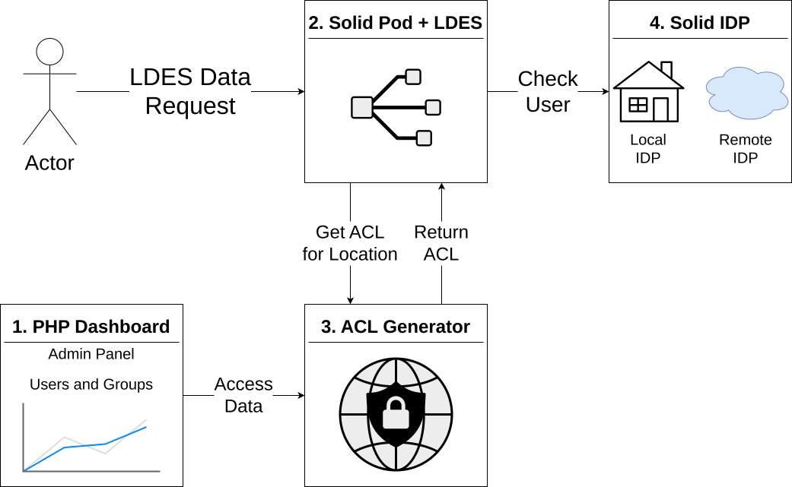

This section presents the architecture of MuMo and explains the main design choices behind its approach to cross-institutional environmental monitoring. Rather than replacing existing museum monitoring infrastructures, MuMo adds a semantic publication and governance layer that enables decentralized data access and controlled sharing across institutions. We first outline the overall system composition and data flow, and then describe the key building blocks—semantic modeling, Linked Data Event Streams for continuous publication, and Solid-based governance—showing how they work together to support both longitudinal analysis and collaboration scenarios such as object loans.

## Dataspace Architecture Based on Solid

MuMo adopts a **dataspace-oriented architecture** based on Solid, a decentralized data platform designed to give data owners control over their data rather than centralizing it within applications [@solid_24; @solid_25; @solidprotocol2022]. Solid is explicitly designed as a decentralization framework in which data storage, identity, and access control are decoupled from individual applications, enabling data to be reused by multiple clients and actors without funneling all data through a centralized service.

This approach aligns with museum practice: institutions are unwilling to relinquish control over their monitoring infrastructure, yet must be able to selectively share data during collaborations such as object loans. Solid provides a conceptual and technical framework in which identity, authorization [@wac], and data location are decoupled from any single application, explicitly aiming to counter the concentration of data within centralized platforms by restoring data ownership to the producing parties.

While some recent research emphasizes cryptographic immutability and tamper resistance through tightly coupled sensor infrastructures, hardware-based attestation, and private distributed ledgers, MuMo instead prioritizes institutional autonomy and operational feasibility by enabling decentralized data publication and access control aligned with existing museum workflows [@ross2024digital].

In MuMo, Solid Pods act as **institutional data endpoints** rather than user-centric storage, enabling long-lived publication of monitoring data that remains independently governed.

## Continuous Data Publication with Linked Data Event Streams

Environmental monitoring produces **continuous, append-only data** that grows over time and is rarely modified retroactively. To reflect this, MuMo publishes monitoring data using **Linked Data Event Streams (LDES)** [@vanlancker2021ldes; @semic_support_centre].

LDES is increasingly adopted as a practical pattern for interoperable publication of evolving datasets, enabling replication and synchronization across organizational boundaries without centralized query services [@semic_support_centre].

Prior work has demonstrated the feasibility of storing and consuming LDES event sources within the Solid ecosystem, supporting the compatibility of event-stream publication with Solid-based access control [@slabbinck2023linked].

LDES enables consumers to:

* retrieve historical data incrementally,
* stay synchronized with newly produced observations,
* avoid repeated querying of centralized services.

An LDES is typically published as a hierarchy of fragments: a tree in which each fragment links to related fragments through semantic relations. These relations allow consumers to navigate to relevant subtrees without scanning the full stream. Choosing how events are grouped into such a fragment tree is known as the fragmentation strategy.

In MuMo, observations are fragmented along the operational dimensions that curators and technicians naturally work with: group, sensor, and time. Concretely, we publish observations under a hierarchical path of the form group-x/sensor-x/year/month/day. This strategy keeps fragments small and stable over time, while preserving a semantic navigation structure.

Because fragment-to-fragment links are expressed as semantic relations, the client can prune irrelevant subtrees early for a given query (e.g., only follow fragments for sensor X within the selected time window), thereby minimizing bandwidth and improving responsiveness.

This publication model proved particularly suitable in a cross-institutional setting, as it allows data consumers to process only the subsets of data they are authorized to access, without requiring the data provider to offer tailored query endpoints [@vanlancker2021ldes].

## Semantic Representation of Sensors and Observations

All data managed by the legacy dashboard is transformed into a semantic representation, including both **environmental observations** and **sensor configuration metadata**. This separation reflects two different kinds of change:

* observations evolve continuously over time,
* sensor configurations evolve discretely when sensors are moved or reconfigured.

The semantic representation builds on established models for describing sensors and observations, most notably the W3C Semantic Sensor Network ontology (SSN/SOSA) [@compton2012ssn;@ssn-sosa], which provides a shared conceptual framework for sensors, observations, and their relationships.

SSN/SOSA was selected in particular for its explicit separation between sensors, observations, and the features of interest being observed, enabling sensor redeployment and contextual change to be represented without altering historical observations [@compton2012ssn].

In MuMo, these concepts are instantiated using OSLO vocabularies [@oslo2016], a Flemish Linked Data standardization framework that profiles and reuses international semantic standards for cross-organizational data exchange.

Sensor metadata is therefore published as a **versioned event stream**, allowing consumers to reconstruct the context in which observations were produced. Group membership and location are encoded explicitly in the semantic descriptions, enabling downstream systems to reason about authorization and interpretation without consulting the legacy dashboard.

## Group-Based Access Control as a Practical Design Choice

Access control in MuMo deliberately mirrors the **group-based authorization model** already in use in the legacy dashboard. Rather than introducing fine-grained authorization at the level of individual observations, access is granted at the level of sensor groups.

At the Solid protocol level, this aligns with authorization mechanisms such as Web Access Control (WAC), which allow servers to enforce access rules on resources and their associated representations [@solidprotocol2022; @wac].

This choice was guided by museum practice: for loan scenarios, institutions require access to all monitoring data related to a specific object or location over a defined period.
Prior work on access control has repeatedly highlighted that fine-grained authorization models, while expressive, introduce significant configuration and usability complexity in operational settings, particularly for non-technical users [@hu2014guide].
Group-level access was therefore found to be both sufficient and manageable, avoiding complexity that would hinder adoption.

Authorization policies defined in the legacy system are reflected in access constraints on published data, allowing cross-institutional sharing without introducing a new access management interface.

The fragmentation strategy used for the LDES publication directly supports this governance model. Since fragments are organized as group-x/sensor-x/year/month/day, Solid’s access control mechanisms (e.g., WAC) can be applied at different levels of the fragment tree. In the deployed system, authentication impacts the first level of the hierarchy: users gain access to the subtree corresponding to a group, which implicitly grants access to all sensors and time slices contained within that group.

At the same time, this structure makes it explicit that finer-grained authorization is technically possible if required by future workflows: access could be restricted at sensor level (by granting only the corresponding sensor subtree) or at temporal level (by granting only fragments for a selected time range). MuMo intentionally does not activate these options to remain aligned with what museum staff can practically configure in the authoritative legacy dashboard.

Although the underlying fragmentation strategy and event-based publication model would technically allow finer-grained access control (e.g., at the level of individual days or measurement types), MuMo intentionally limits authorization to group-level permissions in order to remain aligned with the configuration mechanisms and functional requirements of the legacy dashboard.

## Decentralized Consumption and Aggregation

Because each MuMo deployment publishes its data independently, consumers may need to combine data from multiple sources. MuMo supports this through a client-side dashboard that retrieves sensor descriptions first, determines the user’s authorized scope, and then incrementally consumes the relevant observation streams.

This approach avoids centralized aggregation while still enabling a unified user experience, reinforcing the dataspace principle that **integration occurs at the point of use**.

## Deployment Components and Access-Control Flow

{#fig:deploy-overview width=80%}

Figure \ref{fig:deploy-overview} shows the four runtime components that together bridge the legacy monitoring dashboard with Solid-based identity and authorization. MuMo deliberately keeps the legacy dashboard as the authoritative interface for non-technical staff, while reflecting its group-based authorization decisions into Solid’s Web Access Control (WAC) layer. This is consistent with the project’s broader constraint that the dashboard cannot be replaced and already provides the operational concepts of users, groups, and recursively defined group hierarchies.

### Component 1 — PHP dashboard (admin & group management)

The PHP dashboard is the operational control plane. Administrators manage:

* Groups and group hierarchies (including recursive nesting),
* User-to-group assignments, and
* Cross-institution access by granting group access to WebIDs.

A WebID may originate from the deployment’s *local Solid Identity Provider (IdP)* (Component 4) or from an external provider such as Inrupt. From the dashboard’s perspective, a WebID is simply the stable identifier used to grant or revoke access at group level—matching how museum staff already reason about “who gets access to which loan group”.

### Component 2 — Solid Pod hosting LDES resources (data plane)

The Solid Pod is the enforcement point for data access. It hosts the published resources (including the LDES fragment tree) and applies WAC authorization before serving any protected resource. Conceptually, this is where an incoming request is interpreted in terms of which protected subtree (group/sensor/time path) is being accessed, and whether the requester’s authenticated WebID is allowed to access it.

### Component 3 — ACL generator (policy materialization service)

The ACL generator is the bridge between the dashboard’s group model and Solid’s resource-level authorization. It receives (synchronized) configuration derived from Component 1:

* For each configured *WebID*: the *groups* it belongs to;
* For each group: its *position in the group hierarchy* (to support inherited/recursive membership).

From this input, the ACL generator *materializes WAC ACL documents on demand*. Operationally, its central function is:

> given a request targeting a particular group (e.g., “group 4”), return the effective ACL representation for that group.

Rather than requiring administrators to maintain ACL files manually (which would be error-prone and mismatched with existing workflows), the generator ensures the Solid-side authorization view remains a faithful projection of the dashboard configuration.

### Component 4 — Solid Identity Provider (IdP)

The Solid IdP provides authentication for WebIDs under the local deployment’s authority. However, MuMo does *not* require a single centralized identity authority: when a user presents a WebID from a different IdP, authentication can be performed against that remote IdP as well (subject to standard Solid/OIDC behavior). This keeps identity decentralized while still allowing the dashboard to manage access using WebIDs as portable identifiers.

## End-to-end request flow

1. **Admin configuration (control path):** An administrator updates group membership in the PHP dashboard by associating WebIDs with groups and maintaining the relevant group hierarchy.
2. **Sync to policy service:** These settings are synchronized to the ACL generator as (WebID → groups) plus the group hierarchy.
3. **User data request (data path):** A client requests an LDES resource from the Solid Pod.
4. **ACL resolution:** Before serving the resource, the Solid Pod determines which ACL scope applies (effectively: which group subtree is being accessed?) and consults the ACL generator to obtain the effective ACL document for that scope.
5. **Authentication + authorization:** The Solid Pod validates the requester’s identity via the appropriate IdP (local or remote) and evaluates whether the authenticated WebID is granted access by the generated ACL.
6. **Response:** If authorized, the Solid Pod serves the requested LDES resource; otherwise it denies access.

