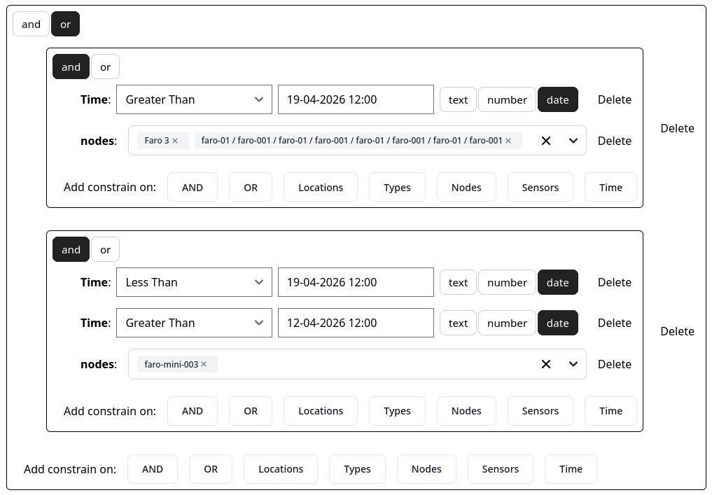
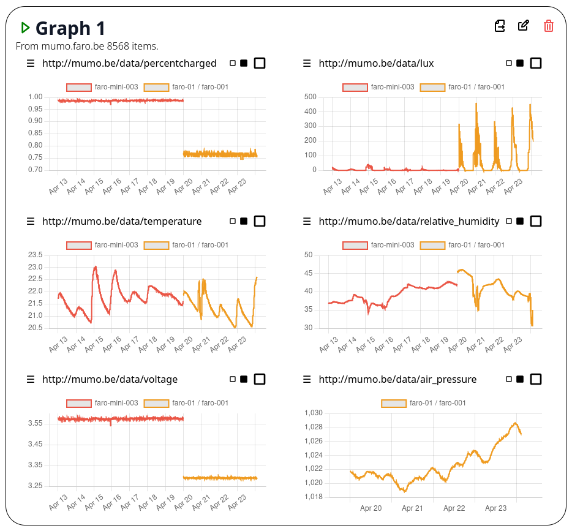
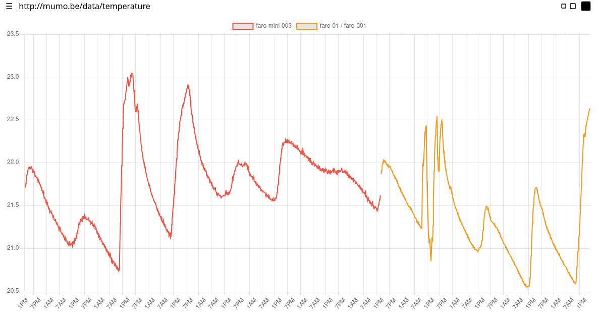

<!-- _class: title -->

# Museum Monitoring: an Environmental Monitoring Dataspace Using The Things Network, Solid, and LDES

**Arthur Vercruysse¹ · Ben De Meester¹ · Julián Rojas¹ · Dieter Suls²**

¹ IDLab, Ghent University – imec &nbsp;·&nbsp; ² Fashion Museum Antwerp (MoMu)

SemDH 2026 · ESWC · May 10, 2026 · Dubrovnik, Croatia

<!-- 
Welcome. This talk reports on MuMo — Museum Monitoring — a three-year applied research project funded by the Flemish Government. The project explored how dataspace principles can make environmental monitoring data in museums more reusable and shareable, without forcing museums to replace the tools they already depend on.
-->

---

# Museums monitor their collections

Temperature · Relative humidity · Light exposure

**But the data stays trapped in vendor dashboards**

- Siloed per installation
- Proprietary formats
- Cross-institution sharing = manual exports

<!-- 
Museums invest significantly in environmental monitoring to preserve cultural heritage objects — paintings, textiles, historical artifacts. The parameters that matter are temperature, relative humidity, and light exposure, all of which directly affect long-term preservation. The problem is that the systems capturing this data are typically tightly coupled to proprietary vendor dashboards. The data is siloed: it's difficult to combine measurements across installations, to align monitoring data with external partners, or to selectively share a well-scoped subset under enforceable access control.
-->

---

# The loan scenario

> **Museum A lends a painting to Museum B**

- Museum A must verify conservation conditions at Museum B
- Museum B cannot expose its full monitoring infrastructure
- Today: ad-hoc exports, emails, delays

<!-- 
The loan scenario is our running example throughout this talk because it's the ultimate stress test for these limitations. When Museum A lends a painting to Museum B, the lending institution needs trustworthy, timely access to environmental data at the borrowing site. At the same time, Museum B is typically unwilling — and shouldn't need — to expose its full internal monitoring landscape. In practice this leads to ad-hoc CSV exports, manual reporting, delays, and reduced transparency.
-->

---

# Three monitoring needs

| Need | |
|------|-|
| **Operational oversight** | Near-continuous readings, alerts |
| **Long-term documentation** | Historical exposure across locations |
| **Selective collaboration** | Scoped, revocable sharing for loans |

<!-- 
MuMo is motivated by three concrete monitoring needs. First, staff need near-continuous operational oversight — time-series views and alerts when conditions leave acceptable ranges. Second, museums need long-term documentation of exposure conditions, so they can reconstruct how an object's environment evolved across locations and organizations throughout its lifecycle. Third, when multiple parties are involved — most notably during loans — access must be manageable and bounded: limited to a specific subset of sensors, a defined time window, and the involved organizations only.
-->

---

# Research questions

**RQ1** — Extend legacy systems for **interoperable, semantic publication**?

**RQ2** — **Selective, revocable** cross-institutional sharing without centralizing governance?

**RQ3** — What do we learn from **operational deployment**?

<!-- 
These needs translate into three research questions. RQ1 asks how dataspace principles can be applied to extend — not replace — existing museum monitoring infrastructure for semantically described, interoperable data publication. RQ2 asks how selective and revocable cross-institutional data sharing can be realized without requiring a shared user directory or centralized identity management. RQ3 asks what practical lessons emerge from actually deploying such an architecture in operational museum settings over multiple years.
-->

---

# MuMo: Project Timeline

<div class="timeline">
  <div class="tl-event">
    <div class="tl-label-top">MoMu identifies problem;<br>LoRaWAN prototype</div>
    <div class="tl-dot v1"></div>
    <div class="tl-year">2019</div>
  </div>
  <div class="tl-event">
    <div class="tl-label-top">PoC: Raspberry Pi<br>+ PHP dashboard</div>
    <div class="tl-dot v1"></div>
    <div class="tl-year">2020–21</div>
  </div>
  <div class="tl-event">
    <div class="tl-label-top">Funding secured;<br>custom hardware &amp; data model</div>
    <div class="tl-dot v2"></div>
    <div class="tl-year">2022–23</div>
  </div>
  <div class="tl-event">
    <div class="tl-label-top">Field trials;<br>dataspace prototype</div>
    <div class="tl-dot v2"></div>
    <div class="tl-year">2022–24</div>
  </div>
  <div class="tl-event">
    <div class="tl-label-top">Production hardware<br>&amp; dataspace</div>
    <div class="tl-dot v2"></div>
    <div class="tl-year">2025</div>
  </div>
  <div class="tl-event">
    <div class="tl-label-top">System in<br>operational use</div>
    <div class="tl-dot v2"></div>
    <div class="tl-year">2026</div>
  </div>
</div>

**Design principle: extend, don't replace**

<!-- 
The project started in 2019 when the Fashion Museum Antwerp — MoMu — identified the problem and built a first LoRaWAN prototype. A funded proof-of-concept followed in 2020-21, producing a working Raspberry Pi setup with a PHP dashboard. MuMo v2, the work we're reporting on today, began in 2022 with Flemish Government funding and has been in operational use since 2026. A key design decision throughout: MuMo v2 deliberately extends the existing dashboard rather than replacing it. Museums already depend on established workflows that are difficult to change in day-to-day practice.
-->

---

<!-- _class: section-header -->

# System Architecture

Data Model · LDES · Solid

---

# Five components

| Component | Role |
|-----------|------|
| **PHP Dashboard** | Operational interface; group management |
| **Solid Pod + LDES** | Published observation fragments |
| **ACL Generator** | Dashboard groups → WAC policies |
| **Solid IdP** | Identity (local or federated) |
| **Investigating Dashboard** | Client-side cross-source analysis |

<!-- 
MuMo consists of five runtime components. The PHP dashboard remains the primary operational interface — staff configure sensors, inspect readings, and manage access through it, just as they did before. The Solid Pod hosts the LDES-structured observation data that clients can consume. The ACL Generator is the bridge component: it watches the dashboard's group configuration and materializes Web Access Control policies on demand. The Solid Identity Provider issues WebIDs, and can accept external ones too. Finally, the investigating dashboard is a separate client-side application for longitudinal analysis and cross-source queries.
-->

---

# Data model: two streams

**RDF** throughout — reusing **OSLO** + **SSN/SOSA**

| Stream | Rate | Content |
|--------|------|---------|
| **Observations** | Fast, append-only | Sensor readings |
| **Sensor metadata** | Slow, versioned | Location, group, config |

SSN/SOSA separates *sensor* · *observation* · *feature of interest*

<!-- 
MuMo uses RDF as the underlying data model, grounded in two established standards. OSLO Sensoren en Bemonstering is a Flemish governmental application profile maintained by Digitaal Vlaanderen for interoperable cross-organizational exchange. It reuses the W3C SSN/SOSA ontology, which is particularly well suited here because it cleanly separates the sensor, the observation, and the feature of interest being observed. This means a sensor can be moved to a new room without rewriting historical observations — the versioned sensor metadata records when the context changed, and consumers join on sensor URI and time to reconstruct the full context of any observation. The two streams have very different dynamics: observations are fast-moving and append-only, while sensor metadata changes slowly and is versioned as events.
-->

---

# Data model: example

<div class="columns">
<div>

**Observation** *(fast)*
```turtle
<obs/e1f3> a sosa:Observation ;
  sosa:madeBySensor <sensors/node-7> ;
  sosa:observedProperty <prop/temperature> ;
  sosa:hasSimpleResult "21.4"^^xsd:decimal ;
  sosa:resultTime "2025-03-15T10:00:00Z" .
```

</div>
<div>

**Sensor metadata** *(slow)*
```turtle
<sensors/node-7/v2> a sosa:Sensor ;
  rdfs:label "Node 7 – Loan Room B" ;
  sosa:isHostedBy <locations/room-b> ;
  schema:validFrom "2025-02-01T00:00:00Z" ;
  schema:validThrough "2025-06-01T00:00:00Z" .
```

</div>
</div>

Join on **sensor URI + time** → full observation context

<!-- 
Here's a concrete example of what the data looks like. On the left, an observation: it records which sensor made it, what property was observed, the result, and the timestamp. On the right, a versioned sensor metadata record: it says that node-7 was deployed in loan room B between February and June 2025. A client reconstructs the full context of an observation by joining its sensor URI with the metadata record that was valid at the observation's result time. Crucially, when the sensor is later moved, a new metadata version is created — the observation itself is never touched.
-->

---

# What is LDES?

**Linked Data Event Streams** — append-only log, published as a **navigable tree of pages**

- Each page = a subset of events + **typed links** to child pages
- Clients traverse the tree; stable pages are cached
- **No query endpoint needed** — any HTTP client works

<!-- 
LDES is a specification for publishing continuously growing datasets as linked, navigable fragments rather than as a monolithic download or a SPARQL endpoint. The publisher divides events into pages — fragments — and each fragment exposes typed links to related fragments using the TREE specification. A client starts at the root and follows links to narrow down to the data it needs. Stable historical pages can be cached aggressively. The key property is that no custom query endpoint is required: the filtering happens through navigation, client-side.
-->

---

# TREE: navigating to the right data

Links carry **semantic meaning**:

| Relation | Meaning |
|----------|---------|
| `tree:EqualToRelation` | subtree where *path* = *value* |
| `tree:GreaterThanOrEqualToRelation` | subtree for timestamps ≥ *value* |

Clients **prune** irrelevant branches before fetching

> Selective access = a navigation problem, not a query problem

<!-- 
The TREE specification defines how fragment relations are expressed. Each relation has a type, a path — the RDF property being filtered on — and a value. An EqualToRelation says: everything under this link has sosa:madeBySensor equal to sensor-1. A client that wants data for sensor-2 simply ignores that branch entirely. This is what makes LDES well suited for cross-institutional settings: providers don't need to implement bespoke query APIs. The structure of the data itself is the query interface.
-->

---

# LDES in MuMo

```
/
└── /group-x              ← location / loan package
    └── /sensor-x         ← sensor
        └── /2025         ← year
            └── /03       ← month
                └── /15   ← bounded daily page
```

Query *"loan group, sensor 7, March 2025"* → **5 hops**, no full scan

<!-- 
In MuMo, observations are fragmented along the three dimensions that museum staff naturally use: group (location or loan package), sensor, and time. The hierarchy goes group → sensor → year → month → day. Daily pages stay bounded in size as new days are simply added as new leaves. For the loan scenario, Museum B publishes the borrowed painting's monitoring data under a dedicated loan group. Museum A's client navigates directly to that group's subtree and retrieves only the relevant observations — typically just a few hops, regardless of how large the total dataset is.
-->

---

# What is Solid?

Decouples **storage · identity · access control** from applications

| Concept | What it is |
|---------|-----------|
| **Solid Pod** | HTTP server you control; data as linked resources |
| **WebID** | A URL that identifies a person or institution |
| **WAC** | RDF-based access control files, co-located with resources |

MuMo uses Pods as **institution-level endpoints**, not user storage

<!-- 
Solid is a W3C specification — originally designed for decentralized social applications — that separates three concerns that are usually bundled together. A Solid Pod is just an HTTP server that stores data as linked resources and enforces access control. A WebID is a URL that globally identifies an agent — a person, a software agent, or in MuMo's case, an institution. WAC — Web Access Control — places RDF-based ACL files next to the resources they protect. Any application that has authorization can read the Pod, regardless of which application created the data. MuMo repurposes this: instead of personal storage, Pods act as institutional data endpoints. The Pod represents the museum.
-->

---

# Solid in MuMo: the loan workflow

1. Museum B creates a **loan group** in the dashboard, assigns sensors
2. Museum B grants Museum A's **WebID** access to that group
3. Museum A authenticates and navigates only the loan subtree
4. Loan ends → sensors removed from group → **access revoked**

No shared user directory · No data replication

<!-- 
Here's how Solid handles the loan scenario end-to-end. Museum B creates a dedicated group in its existing dashboard and assigns the sensors near the borrowed painting to it. The ACL Generator watches this configuration change and materializes a WAC file granting Museum A's WebID access to that group's subtree in the Solid Pod. Museum A's investigating dashboard authenticates using its WebID — from its own identity provider — and can now navigate only the loan group fragments. When the loan ends, Museum B removes the sensors from the group. The ACL is updated, and no new data is accessible. No centralized user management, no data replication, no exposure of unrelated monitoring data.
-->

---

<!-- _class: section-header -->

# The System in Action

A longitudinal monitoring query across a museum loan

---

# Building the query

**Scenario**: an artwork moves from *faro-mini-003* (home institution) to *faro-01* (loan site) around April 19.

The query is an **OR of two AND-groups** — one per leg of the object's journey:

- **Top group**: faro-01 nodes · after April 19
- **Bottom group**: faro-mini-003 · April 12 – 19

Only matching **LDES tree branches** are traversed — irrelevant fragments are never fetched.

> A **collection management system** already records object movements and dates. This query could be auto-generated from those records.

--- 

# Building the query




<style scoped>
p { text-align: center; }
</style>

<!-- 
This is the investigating dashboard's query builder. A conservator wants to trace environmental conditions across an artwork's full loan period. The artwork was at faro-mini-003 from April 12 to 19, then moved to the faro-01 deployment from April 19 onward.

The query captures exactly that: two AND-groups combined with OR. The top group selects the faro-01 nodes for the period after April 19. The bottom group selects faro-mini-003 for the week before. Together they reconstruct the continuous exposure history across two independent institutions.

Importantly, this query does not have to be built by hand. A collection management system — the tool museums use to track object locations and movements — already holds exactly this information: which object was where, and when. Integrating the investigating dashboard with the CMS would allow the query to be generated automatically from the object's movement history, making this kind of cross-institution longitudinal analysis a routine operation.
-->

---

# Results: data fetched live from LDES




<style scoped>
p { text-align: center; }
</style>

--- 
# Results: data fetched live from LDES




<style scoped>
p { text-align: center; }
</style>

--- 

# Results: data fetched live from LDES

<div class="columns">
<div>

**8 568 observations** from `mumo.faro.be`  
6 sensor types · 2 nodes · no central warehouse

Each museum's **Solid Pod** serves its own data — no replication, no shared infrastructure

</div>
<div>

- **Red** — faro-mini-003 (home, Apr 13 – 19)
- **Orange** — faro-01/faro-001 (loan site, Apr 20 – 23)
- Handoff ~Apr 19 visible across all streams
- Temperature & humidity comparable → conditions within acceptable range throughout the loan

</div>
</div>

<!-- 
The dashboard follows only the LDES tree links that match the query — irrelevant branches are pruned before fetching. The result: 8568 observations from mumo.faro.be, plotted across six sensor types. Red lines are faro-mini-003 (home institution, April 13–19), orange are faro-01/faro-001 (loan site, April 20–23).

The cross-over around April 19 is directly visible: percentcharged and voltage reflect the different hardware at each site, lux shows the different lighting conditions. Temperature and humidity remain comparable throughout, giving the conservator confidence that conditions stayed within acceptable ranges across both institutions.

No data was copied or aggregated centrally. Each museum's Solid Pod serves its own observations. The investigating dashboard authenticates with both, navigates their respective LDES trees using the query constraints, and presents a unified view. The shared semantic model — SSN/SOSA throughout — is what makes this integration possible without a shared data warehouse or custom API.
-->

---

<!-- _class: section-header -->

# Conclusion

---

# Conclusion

- **RQ1** — LDES + semantics extend legacy systems without replacing them
- **RQ2** — Solid + WAC enables scoped, revocable cross-institutional sharing
- **RQ3** — Operational feasibility > maximum technical flexibility

**Future work:** object-centric queries linking collection management systems with sensor streams

<!-- 
To summarize. MuMo demonstrates that dataspace principles can be deployed incrementally alongside legacy systems. LDES and semantic modeling answer RQ1 by extending the existing dashboard for interoperable publication. Solid-based governance answers RQ2 by enabling selective, revocable cross-institutional sharing without centralized identity. The lessons learned — group-level access control, client-side integration, institutional pods — answer RQ3 by showing that practical, operationally feasible design choices can be both sufficient and easier to sustain than more technically ambitious alternatives. Future work will explore integrating external data sources such as collection management systems, which would enable object-centric queries across institutional boundaries.
-->

---

<!-- _class: title -->

# Thank You

Arthur Vercruysse · Ben De Meester · Julián Rojas · Dieter Suls

Project: https://faro.be/project/museum-monitoring-tool

Investigating dashboard: https://museummonitoring.github.io/graphs/

*Questions?*
